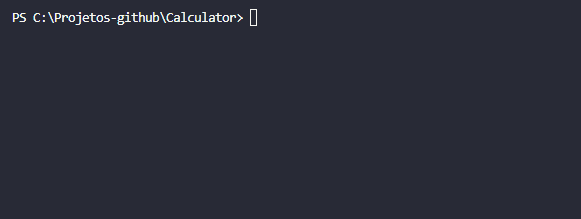

<h1 align="center">Calculadora C# 👨‍💻</h1>

  

## :books: Informações
Primeira versão do meu projeto "Calculadora em C#", o qual a aula foi orientada pelo Andre Baltieri. Neste projeto desenvolvi operações aritméticas com uma interface e código clean. 

## :pushpin: Tecnologias
<ul>
  <li><a href="https://docs.microsoft.com/pt-br/dotnet/csharp/programming-guide/">C#</a></li>
</ul>
